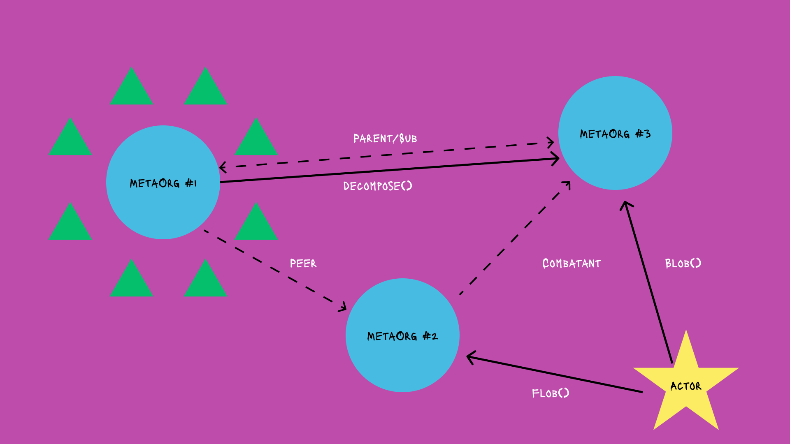

Title: The MetaOrganism DAOFramework

Abstract:

The MetaOrganism framework is designed to facilitate the formation and operation of diverse human groups, ranging from local community gatherings to large-scale corporations and government services. MetaOrgs act dynamic and adaptable organisms, allowing for a more sustainable and equitable interaction with the ever-changing environment of human society. It aims to cover the entire life cycle of human groups, enable customization of processes, promote non-hierarchical delegation of roles and responsibilities, and discusses the rationale behind its design, as well as its pros and cons.

## Video Walkthrough

## General Concept
- Follows the lifecycle of a community/idea/startup/DAO and creates a biomimetic DAO framework for actualizing it
- Predefined Decision making frameworks for Lifecycle: `Idea -> Prototype -> PMF -> Growth -> Spinout -> Death -> Decompose`
- Meta layer ontop of existing DAO frameworks thatsupports different operating models, decision maing frameworks, ideological preferences, etc. for each stage of life. Have a moloch DAO in early stages and seamlessly transfer to GovernorBravo for scaling and progressive decentralization.
- Codifies different types of roles throughout the org from vision to operations, both in terms of what they do and when they can do it
- DNA based access controls via Hats Protocol (called Plasma Membranes)
- Everything will be a smart account with customizable plugins and modules. No reason to write smart contracts (aka DAOs) directly anymore.
- `Panspermia.sol` is all free functions and variables because those are the random building blocks of life, not even organized into a single structure yet.
- Orgs focus on what vs why at different times. Initially, focus on why, then what, then what, then why, etc.
- Pluralistic, Inter-relational, Noospherical Network. Metaorgs can spawn new ones, join old ones, merging with others, etc. Its MetaOrgs all the way down
- Ability to friendly fork out orgs with existing product/resources so long term DAO contributors can continue their work uninhibited by new entrants that want to change the direction of the org.
- Ensuring that organisms evolve, learn, and remain relevant in the complex and ever-changing social environment.
- Implicit right to exit in mitosis and grace period between any phase change start and end where `currentLifecycle` isnt updated yet.
- Every MetaOrg is a cell of another MetaOrg. Only difference is if its a subcell or peercell. Subcells are required to have a parent MetaOrg that controls its TopHat vs peercells are independent and control their own TopHat. (maybe rename ecto/endo cells)

## Open areas of exploration
- What does a decompostion rate look like? Does it affect max amount of resource sthat can be taken at once by an entity? Dont want it to be too low bc than full amount cant get ragequit. Or feature? Like a way to prevent a hostile takeover? Is it one constant per MetaOrg or updatable by X or per Soul?
- What is the difference between a MetaOrganism vs Soul? Is body vs mind an appropriate analogy? What are their interfaces and internal logics?
- How can cells enter and exit an organism? Processes, rights, costs, etc.
- Resource management and distribution
    - How to control a DAOs issuance/buyback via Souls
    - Dynamically change Libido based on Product/team size
- Account Abstraction
    - Figure out how to use Safe{Core}
    - Every MetaOrg should be a SmartAccount. Souls should be Modules/Plugins?
    - Souls return SafeActions/SafeTransactions for MetaOrg to execute
    - Abstract more logic/patterns into Souls

## FAQ
#### How do existing DAOs and DAO frameworks play into this?
Existing DAOs are backwards compatible as MetaOrganism Cells which arent required to implement an interface. DAO frameworks are not backwards compatible but could be wrapped and used as Souls that govern a MetaOrg during a specific stage of its lifecycle.

#### How do I join a MetaOrg?
That depends on the active Soul governaning an organism. Ideally Souls let anyone join at any time and gradually give access controls based on how much Signal a Cell receives from other Cells that they want to work with it.

## Inspos
- (Dawn Of Everything by David Graeber)[https://en.wikipedia.org/wiki/The_Dawn_of_Everything]
- (Project NecroManagement)[https://innerwilds.inthewilderless.com/p/project-necromanagement]